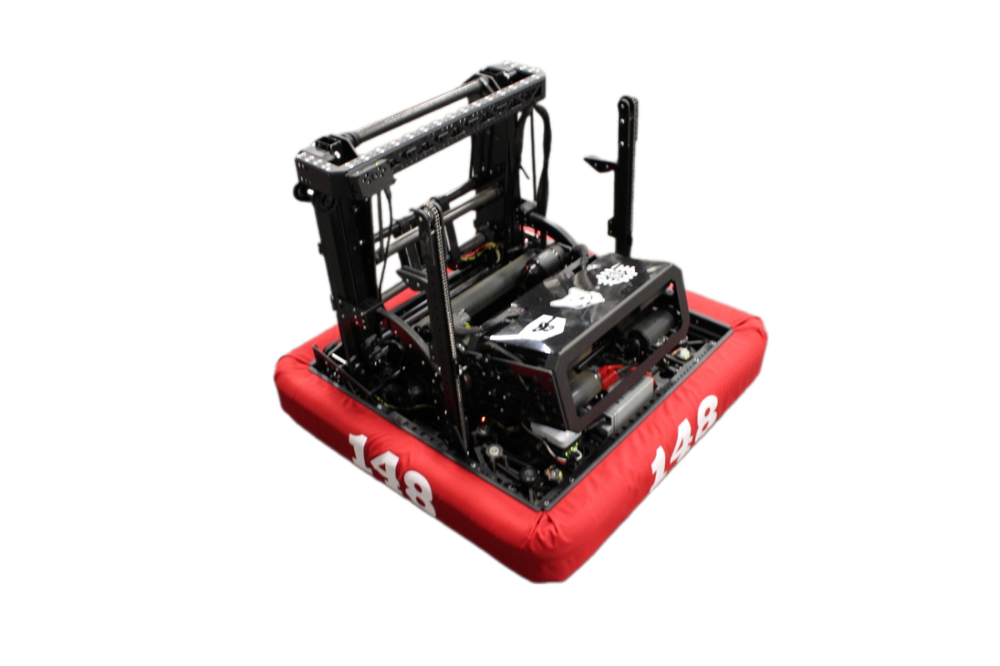

## 2024
Robot Name: [**Outlaw**](https://www.youtube.com/watch?v=npZ0VlJPNRU)
{ width="600"}

### 2023
Robot Name: **Blackout**

Team 148 was **49-24-0** in official play and **55-30-0** overall in 2023. 
As a member of the FIRST In Texas district, Team 148 ranked **10** having earned **260 points**.

### 2022
Robot Name: **Quickdraw**

Team 148 was **60-14-1** in official play and **66-16-1** overall in 2022.  
As a member of the FIRST In Texas district, Team 148 ranked **2** having earned **376 points**.

### 2021
Robot Name: **Kolibri**

Team 148 was **9-5-0** during the 2021 offseason.

### 2020
Robot Name: **Revolover**

Team 148 was **17-1-0** in official play in 2020. 
As a member of the FIRST In Texas district, Team 148 ranked **8** having earned **73 points**.

### 2019
Robot Name: **Overhang**

Team 148 was **66-10-0** in official play and **76-15-0** overall in 2019. 
As a member of the FIRST In Texas district, Team 148 ranked **1** having earned **350 points**.

### 2018
Robot Name: **Uppercut**

Team 148 was **51-4-0** in official play and **74-11-0** overall in 2018.

### 2017
Robot Name: **Rogue**

Team 148 was **43-22-0** in official play and **63-28-0** overall in 2017.

### 2016
Robot Name: **Renegade**

Team 148 was **59-11-0** in official play and **83-15-0** overall in 2016.

### 2015
Robot Name: **Batman & Robin**

Overall, Team 148 had an average qual score of **148.75** and an average playoff score of **190.30** in 2015.

### 2014
Robot Name: **Vader**

Team 148 was **54-12-0** in official play and **83-33-1** overall in 2014.

### 2013
Robot Name: **Viper**

Team 148 was **50-16-0** in official play and **61-30-0** overall in 2013.

### 2012
Robot Name: **Scorpion**

Team 148 was **52-13-0** in official play and **60-19-0** overall in 2012.

### 2011
Robot Name: **Raptor**

Team 148 was **38-5-0** in official play in 2011.

### 2010
Robot Name: **Armadillo**

Team 148 was **38-10-1** in official play and **47-15-1** overall in 2010.

### 2009
Robot Name: 

Team 148 was **20-13-0** in official play and **23-20-0** overall in 2009.

### 2008
Robot Name: 

Team 148 was **41-9-0** in official play in 2008.

### 2007
Robot Name: 

Team 148 was **29-11-2** in official play and **37-17-2** overall in 2007.

### 2006
Robot Name: 

Team 148 was **14-9-0** in official play in 2006.

### 2005
Robot Name: 

Team 148 was **12-10-1** in official play in 2005.

### 2004
Robot Name: 

Team 148 was **11-14-1** in official play in 2004.

### 2003
Robot Name: 

Team 148 was **16-4-1** in official play in 2003.

### 2002
Robot Name: 

Team 148 was **1-7-1** in official play in 2002.

### 2000
Robot Name: 

Team 148 was **0-1-0** in official play in 2000.