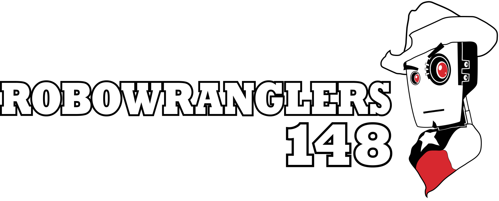
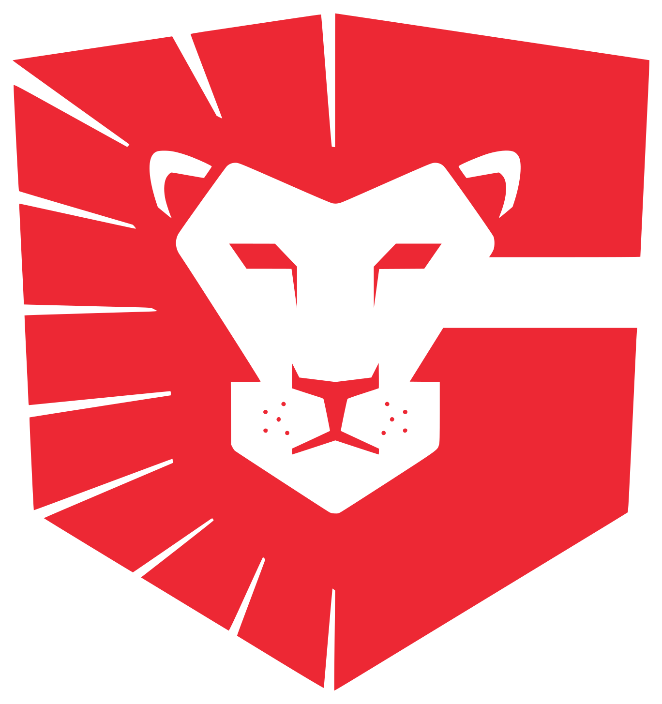

<figure markdown>
  { width="600"}
</figure>

<iframe src="https://www.tickcounter.com/widget/countdown/4962022" style="top:0; left:0; width:100%; height:100%; position:absolute; border:0; overflow:hidden" title="First Comp of 2024"></iframe>

# About the Robowranglers

The Robowranglers are a team of students and mentors from **Greenville, TX** that participates in the FIRST Robotics Competition ([FRC](https://www.firstinspires.org/robotics/frc)). The team **designs**, **builds**, and **programs** robots to compete against other teams in the annual competition. The team is known for their innovative designs and successful performance in the competition. The team is a volunteer-based organization, and the students gain valuable skills in areas such as **engineering**, **programming**, and **teamwork**.

### Robowrangler Pride
 
The Robowranglers have been going strong since **1992** and are known for their **innovative designs** and successful performance in the FIRST Robotics Competition ([FRC](https://www.firstinspires.org/robotics/frc)). They are consistently a strong team in the competition and have won **numerous awards** and accolades over the years.

Some of their notable achievements include:

* **1993** FIRST Robotics Competition Championship Winner

* **2008** Einstein Field Championship Winner

* **2018** Einstein Field (Houston) Championship Winner

In addition to their competitive success, the team is also known for their commitment to community outreach and **STEM** education, and for their strong team culture and work ethic.

### What Our Students Learn

The Robowranglers equip the **STEM** leaders of tomorrow with the tools they need today. Through their involvement with the team, the students of Greenville, TX are getting lessons for wherever life leads.

#### Robowranglers Learn:

* Solving challenging problems with **creative solutions** can be a lot of fun.

* The world needs hard workers who will solve the problems of tomorrow.

* To celebrate failures as opportunities to learn and improve.

* To **embrace challenges** instead of avoiding them.

* To be **comfortable** trying things that might not work.

* To be comfortable solving problems that have no right or wrong answer.

* How fulfilling it can be to work hard, and **chase excellence** in everything they do.

=== "Technical Skills"

    Using the **technical skills** they develop on the team, Robowrangler students intern with local tech companies while still in high school; they do **product development** and **design work** before ever attending college.

=== "Soft Skills"

    Robowrangler students get the chance to practice the “soft skills” they need to be **successful** in the modern workplace. While many companies are struggling to find employees with these skills, our students are crafted into workforce-ready leaders who have mastered the concepts of **problem solving**, **critical thinking**, and **teamwork**.

=== "Life Lessons"

    Perhaps most importantly, Robowrangler students are given the chance to solve very difficult problems. This competition is sometimes described as “the hardest fun you’ll ever have.”

    When you spend your time solving problems, you spend a lot of time with failure. This is where Robowranglers receive the hardest lessons, and the team can provide its **biggest impact**.

### Special Thanks To Our Sponsors!

=== "Greenville Independent School District"

    { align=left width="200" }

    Greenville ISD, which encompasses the city of Greenville, Texas and a surrounding five to seven-mile radius, is a school district that has something to offer just about everyone. Large enough to offer progressive programs yet small enough to allow teachers the chance to cultivate a personal, active interest in each student, Greenville ISD - home to the World Champion Greenville High School Robotics Team - encourages students to seek enrichment but reaches out to those with unique learning needs. Greenville ISD, in keeping with its mission statement, “Prepares, inspires, and empowers students in a safe and nurturing environment to become responsible citizens who successfully compete in a global society.”

=== "Innovation First International"

    { align=left width="200" }
    { align=left width="200" }

    Innovation First International began by producing electronics for autonomous mobile ground robots and is now a leader in educational and competitive robotics products and a growing developer of consumer robotics toys. Incorporated in 1996, Innovation First International is a privately held corporation that was founded on the belief that innovation is necessary very early in the design process to produce simple and elegant product designs. Innovation First is known for producing HEXBUGs as well as being the manufacturer and founder of VEX robotics. They also produced the control system used in FRC competitions until 2008. They are our largest sponsor and previously housed our team's practice facilities. In addition to this, they also employ many of the Engineers that serve as mentors to the team. Innovation First had previously sponsored Robowranglers under the name Rack Solutions.

!!! note "Send us Mail!"

    Robotics Team  

    Greenville High School  

    3515 Lion's Lair Rd.  

    Greenville, TX 75402
